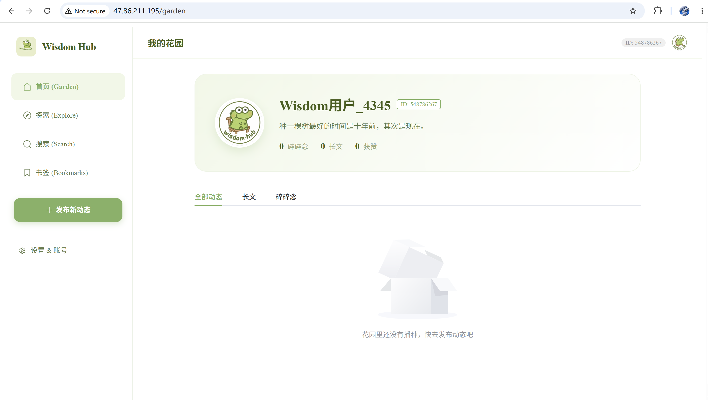

# Wisdom Hub

基于 Spring Boot + Vue3 的前后端分离知识社区平台，支持内容发布、评论互动、图片上传、权限控制与个人空间管理。

项目主要用于练习 Java Web 后端开发、Redis 缓存、JWT 鉴权、对象存储上传以及 Linux 云服务器部署等工程实践。

---

## Features

- 用户注册与登录（JWT 鉴权）
- Markdown 文章发布与编辑
- 评论、点赞与收藏功能
- 个人私密空间与公开广场切换
- OSS 图片上传
- Redis 缓存支持
- 全局关键词搜索
- Vue3 前后端分离开发
- Linux 云服务器部署

---

## Tech Stack

### Backend

- Spring Boot 3
- Java 17
- MyBatis
- MySQL
- Redis
- JWT

### Frontend

- Vue3
- TypeScript
- Vite
- Element Plus
- Axios

### Deployment

- Docker
- Nginx
- Linux Server
- Aliyun OSS

---

# Project Structure

## Backend

```text
wisdom-hub-server
├── src/main/java/com/wisdomhub
│   ├── config
│   ├── controller
│   ├── dto
│   ├── entity
│   ├── exception
│   ├── interceptor
│   ├── mapper
│   ├── service
│   ├── util
│   └── context
│
├── src/main/resources
│   ├── mapper
│   ├── db
│   └── application.yml
```

---

## Frontend

```text
wisdom-hub-web
├── public
├── src
│   ├── assets
│   ├── components
│   ├── layout
│   ├── router
│   ├── utils
│   ├── views
│   ├── App.vue
│   ├── main.ts
│   └── style.css
│
├── package.json
├── vite.config.ts
└── tsconfig.json
```

---

# Quick Start

## Backend

进入后端目录：

```bash
cd wisdom-hub-server
```

配置：

```yaml
application-dev.yml
```

启动项目：

```bash
mvn spring-boot:run
```

---

## Frontend

进入前端目录：

```bash
cd wisdom-hub-web
```

安装依赖：

```bash
npm install
```

启动开发服务器：

```bash
npm run dev
```

---

# Database

项目使用 MySQL 作为主数据库。

初始化数据库：

```sql
source schema.sql
```

Redis 用于：

- 登录状态缓存
- 验证码缓存
- 高频接口优化

---

# API Examples

## 用户登录

```http
POST /api/auth/login
```

---

## 发布文章

```http
POST /api/posts
```

---

## 获取文章详情

```http
GET /api/posts/{id}
```

---

## 上传图片

```http
POST /api/files/upload
```

---

# Deployment

项目支持 Docker 与 Linux 云服务器部署。

## Docker

```bash
docker-compose up -d
```

---

## Nginx Reverse Proxy

Nginx 用于：

- 前端静态资源部署
- API 反向代理
- 图片访问转发

---

# Screenshots

## Home Page


---

## Post Editor


---

## User Space



---

# Future Plans

- AI 内容辅助功能
- 多语言支持
- 搜索优化
- 移动端适配
- 推荐系统

---

# Author

Fan Fengdian

GitHub:
https://github.com/fan70dev-bit
